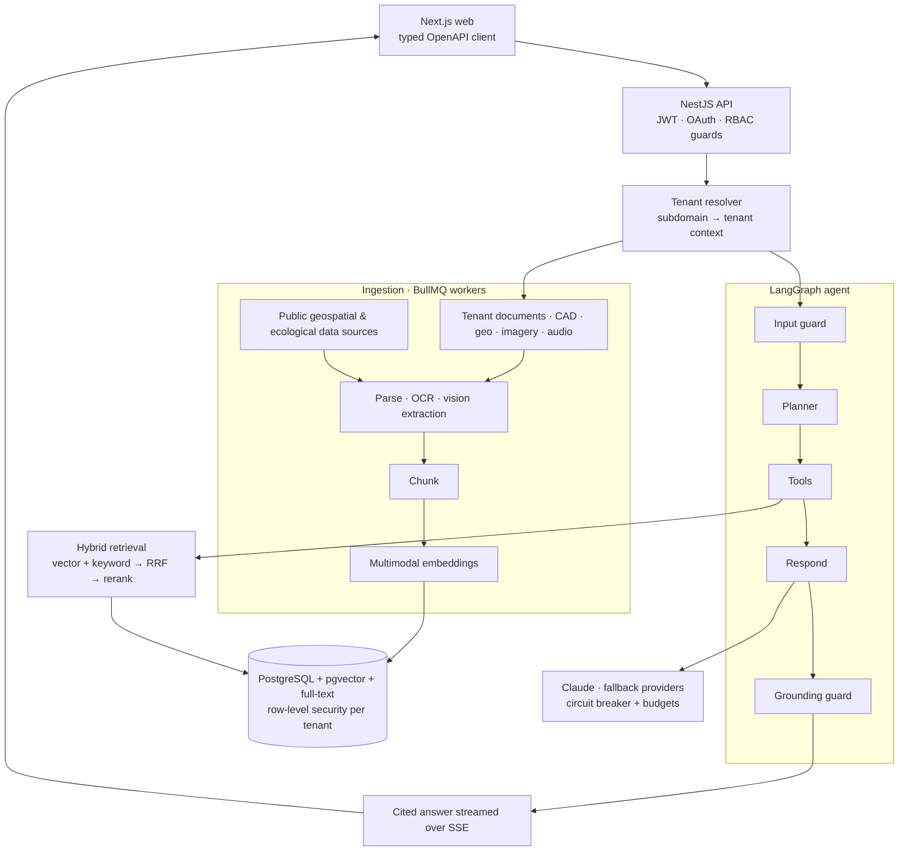
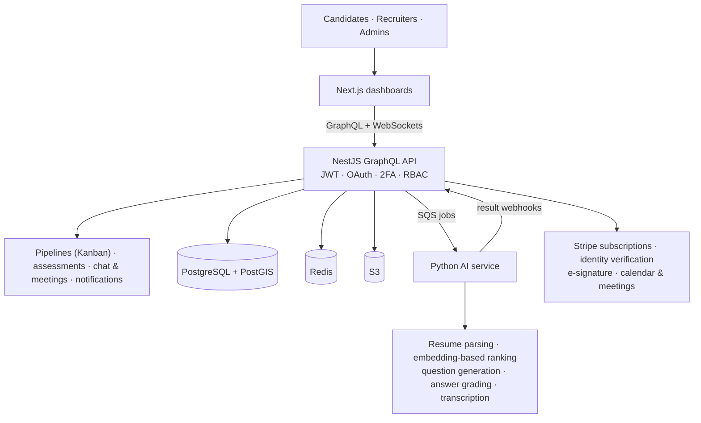
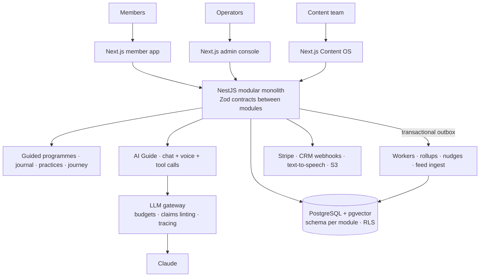
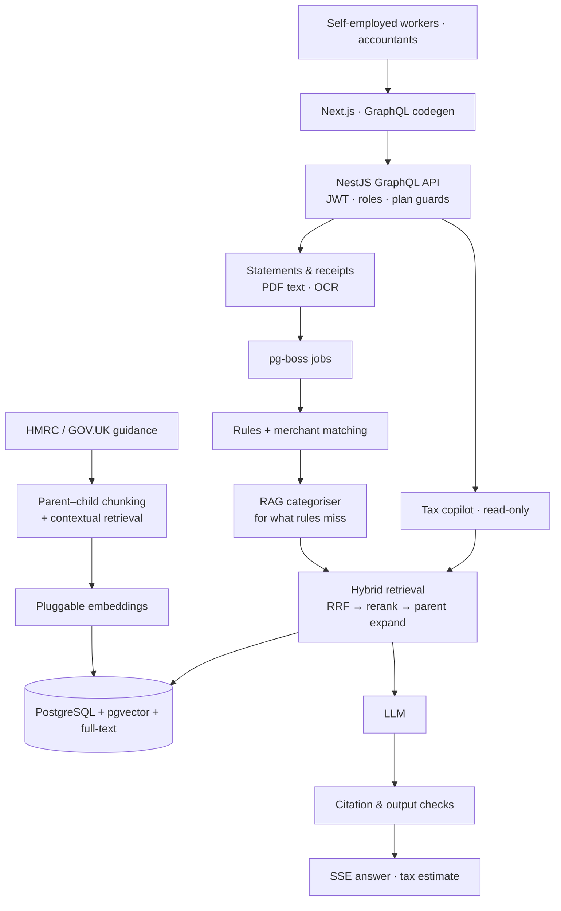

<!--
  GitHub Profile README — MuhammadAsadAkmal
  Team Lead · Full-Stack Engineer · SaaS · AI · System Architecture
  Visual assets live in /assets (hand-built SVGs, no external services).
-->

<a href="https://asadakmal.com">
  <picture>
    <source media="(max-width: 640px) and (prefers-color-scheme: dark)" srcset="https://raw.githubusercontent.com/MuhammadAsadAkmal/MuhammadAsadAkmal/main/assets/header-mobile.svg" />
    <source media="(max-width: 640px) and (prefers-color-scheme: light)" srcset="https://raw.githubusercontent.com/MuhammadAsadAkmal/MuhammadAsadAkmal/main/assets/header-mobile-light.svg" />
    <source media="(prefers-color-scheme: dark)" srcset="https://raw.githubusercontent.com/MuhammadAsadAkmal/MuhammadAsadAkmal/main/assets/header.svg" />
    <source media="(prefers-color-scheme: light)" srcset="https://raw.githubusercontent.com/MuhammadAsadAkmal/MuhammadAsadAkmal/main/assets/header-light.svg" />
    
  </picture>
</a>

<p align="center">
  <a href="https://asadakmal.com"></a>
  <a href="https://linkedin.com/in/muhammad-asad-akmal"></a>
  <a href="https://twitter.com/M_Asad_Akmal"></a>
  <a href="mailto:m.asadakmal1999@gmail.com"></a>
  
</p>

<br/>

## `~/about`

I'm a **Team Lead and Full-Stack Engineer** focused on building and scaling **production SaaS platforms, AI-powered applications, and complex web systems**. I work across hands-on engineering, system architecture, technical decision-making, and team leadership: requirements, architecture, implementation, code review, deployment, and production.

```ts
// profile.ts
const asad = {
  role:         ["Team Lead", "Full-Stack Engineer"],
  builds:       ["Production SaaS", "Multi-tenant platforms", "AI-powered applications"],
  stack:        ["Next.js", "NestJS", "TypeScript", "React", "PostgreSQL", "GraphQL", "REST"],
  ai:           ["Generative AI", "RAG", "AI agents", "LLM apps", "Embeddings", "Agentic workflows"],
  ships_to:     ["AWS", "Docker", "Nginx", "GitHub Actions"],
  shipping_now: ["SiftSight", "Terravive", "Kynos"],
  cares_about:  ["maintainable", "secure", "scalable", "observable", "operable"],
} as const;
```

<table>
  <tr>
    <td width="50%" valign="top">
      <h4>🏗️ Architect</h4>
      Designing <b>scalable SaaS architectures</b> and multi-tenant platforms: <b>monorepos, microservices, API architecture, authentication, RBAC, 2FA, payments</b> and third-party integrations.
    </td>
    <td width="50%" valign="top">
      <h4>⚡ Build</h4>
      Full-stack applications with <b>Next.js, NestJS, TypeScript, React, PostgreSQL, GraphQL and REST</b>, deployed and operated on <b>AWS, Docker, Nginx</b> and <b>GitHub Actions CI/CD</b>.
    </td>
  </tr>
  <tr>
    <td width="50%" valign="top">
      <h4>🤖 Make AI useful</h4>
      <b>Generative AI, RAG, AI agents, LLM applications, embeddings</b> and agentic workflows. Systems that combine <b>retrieval, tools, structured workflows, validation and streamed responses</b>.
    </td>
    <td width="50%" valign="top">
      <h4>👥 Lead</h4>
      <b>Technical direction, architecture decisions, code reviews, engineering standards, mentoring and delivery</b>, while staying hands-on with the code.
    </td>
  </tr>
</table>

<br/>

## `~/stack`

<picture>
  <source media="(prefers-color-scheme: dark)" srcset="https://raw.githubusercontent.com/MuhammadAsadAkmal/MuhammadAsadAkmal/main/assets/architecture.svg" />
  <source media="(prefers-color-scheme: light)" srcset="https://raw.githubusercontent.com/MuhammadAsadAkmal/MuhammadAsadAkmal/main/assets/architecture-light.svg" />
  
</picture>

<p align="center">
  
</p>

<details>
<summary><b>Expertise matrix</b> <sub>(click to expand)</sub></summary>
<br/>

| Area                       | Focus                                                             |
| -------------------------- | ----------------------------------------------------------------- |
| **Full-Stack Engineering** | Next.js · React · NestJS · Node.js · TypeScript                   |
| **System Architecture**    | SaaS · Multi-Tenancy · Monorepos · Microservices · API Design     |
| **AI Engineering**         | RAG · AI Agents · LLM Applications · Embeddings · Agent Workflows |
| **Backend Engineering**    | NestJS · GraphQL · REST · PostgreSQL · Redis                      |
| **Frontend Engineering**   | Next.js · React · TanStack Query · Zustand · Tailwind CSS         |
| **Cloud & DevOps**         | AWS · Docker · Nginx · GitHub Actions · CI/CD                     |
| **Security**               | JWT · OAuth · RBAC · 2FA · Secure API Design                      |
| **Integrations**           | Stripe · PayPal · CRM · Analytics · Identity Verification         |
| **Technical Leadership**   | Architecture · Code Review · Mentoring · Engineering Standards    |

</details>

<br/>

## `~/deployments`

<sub>Platforms I've built and worked on. Full case studies at <a href="https://asadakmal.com">asadakmal.com</a>.</sub>

<table>
  <tr>
    <td width="50%" valign="top">
      <h3><a href="https://siftsight.com/">SiftSight <sub>(formerly Prime Roster)</sub></a></h3>
      AI-powered recruitment and talent platform combining ATS workflows, talent discovery, candidate matching, assessments, verification, pipelines, subscriptions, recruiter workflows, and automation.
      <br/><br/>
      <code>AI</code> <code>ATS</code> <code>Talent Matching</code> <code>Subscriptions</code> <code>Automation</code>
    </td>
    <td width="50%" valign="top">
      <h3><a href="https://www.terravive.ai/">Terravive</a></h3>
      Multi-tenant AI ecological / site-intelligence SaaS using structured knowledge, embeddings, RAG, and agent-based workflows.
      <br/><br/>
      <code>Multi-Tenant</code> <code>RAG</code> <code>Embeddings</code> <code>AI Agents</code>
    </td>
  </tr>
  <tr>
    <td width="50%" valign="top">
      <h3><a href="https://kynosnow.com/">Kynos</a></h3>
      SaaS platform focused on guided experiences, structured workflows, personalized recommendations, and facilitator-driven experiences.
      <br/><br/>
      <code>SaaS</code> <code>Workflows</code> <code>Recommendations</code>
    </td>
    <td width="50%" valign="top">
      <h3><a href="https://asadakmal.com/projects">Deep Lawn</a></h3>
      Production SaaS combining AI/ML, geospatial data, aerial imagery, e-commerce, CRM integrations, and automated quoting.
      <br/><br/>
      <code>AI/ML</code> <code>Geospatial</code> <code>E-commerce</code> <code>CRM</code>
    </td>
  </tr>
  <tr>
    <td width="50%" valign="top">
      <h3><a href="https://asadakmal.com/projects">VisionTrack AI</a></h3>
      AI-focused production platform combining modern full-stack engineering with intelligent application workflows.
      <br/><br/>
      <code>AI</code> <code>Full-Stack</code> <code>Intelligent Workflows</code>
    </td>
    <td width="50%" valign="top">
      <h3>TaxFiy <sub>(personal project)</sub></h3>
      AI tax assistant for UK self-employed workers: ingests bank statements and receipts, categorises transactions with rules plus RAG, estimates tax, and answers questions from cited HMRC guidance.
      <br/><br/>
      <code>RAG</code> <code>Hybrid Retrieval</code> <code>OCR</code> <code>GraphQL</code>
    </td>
  </tr>
</table>

### Under the hood

<sub>How the flagship systems are put together, at a high level. Click to expand.</sub>

<details>
<summary><b>Terravive</b>: multi-tenant RAG with a guarded agent loop</summary>
<br/>



**Highlights:** tenant isolation enforced twice (repository scoping + Postgres RLS) · hybrid retrieval with reranking · rules-first guardrails · OpenTelemetry tracing · retrieval-quality evals in CI.

</details>

<details>
<summary><b>SiftSight</b>: recruitment platform with an event-driven AI service</summary>
<br/>



**Highlights:** async AI workloads over a queue, decoupled from the API · GraphQL end to end with codegen · CI/CD with automatic rollback.

</details>

<details>
<summary><b>Kynos</b>: contract-first modular monolith with a governed AI guide</summary>
<br/>



**Highlights:** every model call goes through one gateway with cost budgets and output linting · scores computed deterministically, never by the LLM · outbox-driven events · safety and isolation gates in CI.

</details>

<details>
<summary><b>TaxFiy</b>: rules-first categorisation with a RAG fallback and a cited copilot</summary>
<br/>



**Highlights:** cheap deterministic rules before any LLM call · citations the model wasn't given are stripped · LLM-as-judge from a different model family · per-user AI cost caps.

</details>

<br/>

## `~/changelog`

<sub>What I'm focused on right now. The pipeline runs top to bottom:<br/>
<b>Technical Leadership → System Architecture → Production SaaS → AI / RAG / Agentic Workflows → Scalable Full-Stack Systems</b></sub>

```diff
@@ current focus @@
+ Designing production-grade AI-powered SaaS systems
+ Building RAG and agentic workflows
+ Building reliable AI-to-tool execution pipelines
+ Engineering secure multi-tenant applications
+ Developing type-safe monorepos
+ Improving system architecture and scalability
+ Mentoring engineers and improving engineering standards
```

<br/>

## `~/principles`

```console
$ git log --oneline --no-decorate principles
a1c0de7  architecture before complexity     keep systems understandable as they scale
7e5afe1  type safety everywhere             fewer runtime errors, better developer experience
9f0d5c1  production over prototypes         software must stay maintainable after launch
5ecd35e  secure by design                   authn, authz, validation and data protection are architecture
ac0ffee  ai with context                    useful AI needs reliable data, retrieval, tools and validation
a07ed05  automation where it matters        remove repetitive operational work with reliable workflows
1eade75  leadership through engineering     sound decisions, clear standards, mentoring, ownership
```

<br/>

## `~/metrics`

<sub>Rendered by a GitHub Action in this repo and refreshed daily, with no third-party stats service.</sub>

<p align="center">
  
  
</p>
<p align="center">
  <picture>
    <source media="(prefers-color-scheme: dark)" srcset="https://streak-stats.demolab.com?user=MuhammadAsadAkmal&theme=tokyonight&hide_border=true&background=1a1b27&ring=7AA2F7&fire=BB9AF7&currStreakLabel=7AA2F7&border_radius=12" />
    <source media="(prefers-color-scheme: light)" srcset="https://streak-stats.demolab.com?user=MuhammadAsadAkmal&theme=default&hide_border=true&background=F6F8FD&ring=2E5CD8&fire=7847BD&currStreakLabel=2E5CD8&border_radius=12" />
    
  </picture>
</p>
<p align="center">
  
</p>

<picture>
  <source media="(prefers-color-scheme: dark)" srcset="https://raw.githubusercontent.com/MuhammadAsadAkmal/MuhammadAsadAkmal/output/github-contribution-grid-snake-dark.svg" />
  <source media="(prefers-color-scheme: light)" srcset="https://raw.githubusercontent.com/MuhammadAsadAkmal/MuhammadAsadAkmal/output/github-contribution-grid-snake.svg" />
  
</picture>

<br/>

## `~/connect`

<p align="center">
  <a href="https://asadakmal.com"></a>
  <a href="https://linkedin.com/in/muhammad-asad-akmal"></a>
  <a href="https://twitter.com/M_Asad_Akmal"></a>
  <a href="mailto:m.asadakmal1999@gmail.com"></a>
</p>

<p align="center">
  <sub><code>$ exit 0</code> · built by Muhammad Asad Akmal with Next.js · NestJS · TypeScript · AI</sub>
</p>
